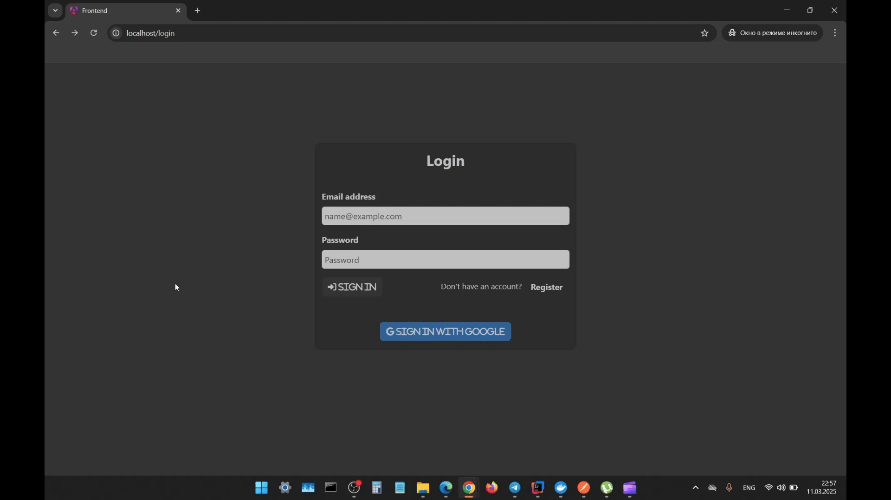

# Task management system
## Table of content
1. [Overview](#overview)
2. [Features](#features)
3. [Technologies Used](#technologies-used)
    * [Backend](#backend)
    * [Frontend](#frontend)
4. [Installation](#installation)
5. [Contacts](#contacts)
## Overview
Task Management System is a full-stack application that enables users to manage their tasks while working in a team effectively.
It offers features such as user registration with secure email validation, project management (including project creation,
user addition and removal, task creation for team members, and project deletion), and task management (including task creation,
status updates, comments, file attachments, and task deletion). The application ensures security using JWT tokens 
and adheres to best practices in REST API design. The backend is built with Spring Boot 3 and Spring Security 6,
while the frontend is developed using Angular with Bootstrap for styling.
### Project architecture diagram

## Features
### Users can create a new account with email verification and log in using their email and password.

### Both new and existing users can log in using their Google accounts via OAuth2 authentication.

### Project Management: Users can create projects, add and delete other users in the team, create tasks for team members, and retrieve all tasks by project. Team members can quit a project.

### Task Management: The project manager and responsible users can update the status of tasks, add comments, attach files, and delete tasks.

## Technologies Used
### Backend


### Frontend


## Installation
### With Docker
1. Download this project.
2. Create a new file named `.env` in the root directory of this project.
3. Copy all data from this [file](https://drive.google.com/file/d/1BMgBb2hqjRVglaZo6E9Ob4sNM-SuGKB8/view?usp=sharing) and paste it into the new `.env` file.
4. Open a terminal, navigate to the root of the project, and run the following commands:
```
mvn clean package
docker-compose up --build
```
5. To start using the application, paste the following URL into the browser search bar:
```
http://localhost:80/login
```
### Other ways
#### With locally installed database
If you have MySQL or Postgres installed on your machine, you can run the app with them. Just fill all database-related fields in the `application.properties` file (if using Postgres, you should also change the driver in the `application.properties` file, the dependency for Postgres is already added to the project). If you are going to run the backend in Docker, delete all database-related data from the `Dockerfile` and `docker-compose.yml` file.
#### With H2 in-memory database
All you need to do is delete rows from 3 to 9 (inclusive) in the `application.properties` file, copy rows from 1 to 5 (inclusive) from the `application.properties` file in the `test` folder, and paste them into the `application.properties` file in the `main` folder. Also, if you are going to run the backend in Docker, delete all database-related data from the `Dockerfile` and `docker-compose.yml` file.
#### Run backend locally
Fill in all rows with empty values in the `application.properties` file using data from this [file](https://drive.google.com/file/d/1BMgBb2hqjRVglaZo6E9Ob4sNM-SuGKB8/view?usp=sharing). If you are going to run the database locally too, change the database URL, username, and password to your own, and the driver if needed. If you are going to run the database in Docker, delete all backend-related data from the `Dockerfile` and `docker-compose.yml` file.
#### Run frontend locally
If you have Node.js installed, open your terminal, navigate to the root of the project, then to the `frontend` folder, and run the following command:
```
ng serve --port 80
```
## Contacts
### +380 97 293 50 98
### markatovbohdan@gmail.com
### [LinkedIn](https://www.linkedin.com/in/bohdan-markatov)
### [Telegram](https://t.me/BogdanMarkatov)
