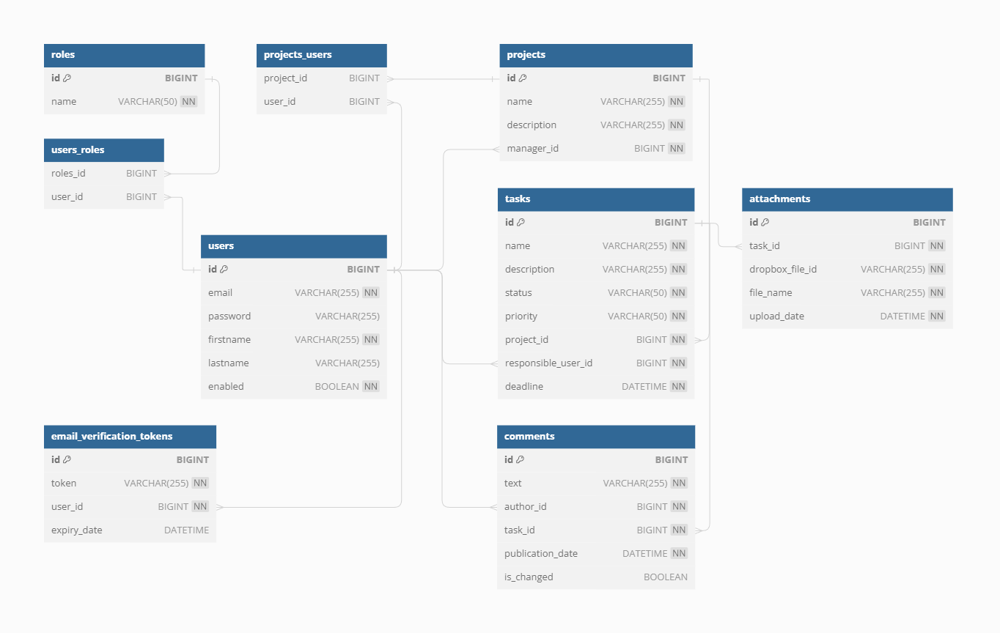

# Task management system
## Table of content
## Overview
The Task Management App is a backend application designed for team-based task management. Key features include:
* User registration with email confirmation
* Login via email and password or Google OAuth2
* Project creation and management
* Adding and removing team members
* Creating, updating, and deleting tasks
* Adding comments and attachments to tasks

Users can update task statuses, add comments, and upload attachments. Security is ensured through JWT tokens, adhering
to best practices in REST API design. The backend is built with Spring Boot 3 and Spring Security 6.
## Technologies Used
* Spring Boot 3
* Spring Security 6
* JWT Token Authentication
* Spring Data JPA
* JSR-303 and Spring Validation
* OpenAPI and Swagger UI Documentation
* Liquibase: Manages database migrations
* Docker
* Google API
* Dropbox API
## Class diagram
